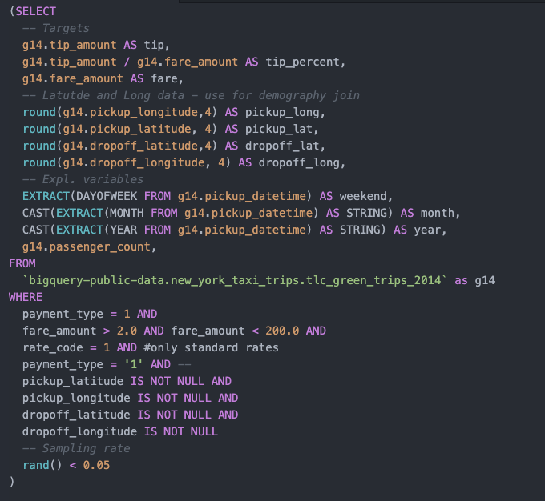

# ML Clustering Taxi Tips using Inferred Passenger Characteristics


By the time a taxicab has arrived at it's passengers' destination, the taxi's information system will have collected a varity of data reflecting ride characteristics. Pickup time, location, trip duration, number of passenegers, surcharges, tolls and more manifest in datasets containing the characteristics of the tens of millions of taxi rides taken each year by New Yorkers. These characteristics are, for the most part, known to drivers before they complete their trip; drivers can estimate trip duration and can predict any tolls they might face on the way. Most prediction has, importantly, attempted to analyse the effect of these various factors on taxi fare ammounts. Yet, fares fail to paint the full picture. Until the completion of a trip, taxi drivers remain uncertain about their trip earnings as they wait for tipped wages to factor in. 


Taxi drivers depend on tips for approximately 17% of their taxi based income - the average tip is 17%. Since there is wide variation (how much variance? what is the range) in tipping across types of trips and customres, there is reason to value predictions about tipped ammounts. Better predictions of tipped ammounts should enable taxi-drivers to better allocate their services and maximise revenue. If we choose to understand tipping as a factor of the consumer surplus implicit in a trip, then tipped ammounts might be an indicator of potential improvements to other fare models that do not include tips. Lastly, in the long term, models that predict tipping might serve as coal-mine canaries for a possible dying tipping culture.


```python
import numpy as np
import matplotlib
import matplotlib.pyplot as plt
from matplotlib import rcParams
%matplotlib inline
import seaborn as sns
import pandas as pd
import pandas_gbq as gbq
project_name = 'qtm-essay'
import warnings
warnings.filterwarnings('ignore')
from sklearn import preprocessing
from sklearn.impute import MissingIndicator
from datetime import datetime
from uszipcode import SearchEngine, SimpleZipcode, Zipcode
import math
from statsmodels.imputation.mice import MICEData # Used to impute missing data for zip code regional information
```

# Loading Data

The bigquery data are separated into different tables for each year. Tables for taxi trips occuring between 2014 and EOY 2017 share the same schema. Geolocation data does not exist in the 2018 data.

Can even anonymised, vague information be predictive of taxi occupant behaviors? How much value is there in geolocation data?

To answer this question, we're going to do some simple model comparison between predictive tipping models including Inferred Passanger Characteristics (IPC) and those not including them. 

Revenue implications are substantial. Comprehensive gelocation effects on revenue streams may be important for investors, public policy designers, and drivers. Evidence of discrimination may surface. 

Green cab revenue since 2014 total 613,391,413


Rather than load the whole dataset into python -> sample -> train, we are going to sample off the aggregated 2017, 2016 datasets for model construction then test on 2018. 

1. Takes up less memory
2. Lets us get more predictive power from month, season, time of year etc.
3. Garuntees no sampling leakage.t


We could load the data into our python env, but that would be slower than just sampling from SQL 


For the autoregressive component, we're going to use data from three years worth of trips, sampled. 

It seems someone has taken a trip from brooklyn to Rogers Executive Airport, in Springvale Arkansas


```python
# Load queries to local env.
green_pickups_2016_query = open("green_pickups_2016.sql", 'r').read()
green_dropoff_2016_query = open("green_dropoff_2016.sql", 'r').read()

# Pass queries to GBQ and store in DataFrame
green_pickups_2016 = pd.io.gbq.read_gbq(green_pickups_2016_query, project_id = project_name)
green_dropoff_2016 = pd.io.gbq.read_gbq(green_dropoff_2016_query, project_id = project_name)
```

    Downloading: 100%|██████████| 271039/271039 [00:10<00:00, 27100.77rows/s]
    Downloading: 100%|██████████| 589330/589330 [00:19<00:00, 30365.75rows/s]


```python
# Color Mapping tool at: https://html-color-codes.info/colors-from-image/
# Colors taken from NYC Subway Map
matplotlib.rc('axes', **{'grid': False})
rcParams['figure.figsize'] = (8.75, 8.5)
rcParams['figure.dpi'] = 250
plt.rcParams['axes.facecolor'] = '#9ECAED'

# Pickups Graphic
green_pickups_2016.plot(kind='scatter', x='long', y='lat',
                        color='#009C60', xlim=(-74.06,-73.77),
                        ylim=(40.61, 40.91), s=.02, alpha=.8);

# Dropoffs Graphic
green_dropoff_2016.plot(kind='scatter', x='long', y='lat',
                        color='#009C60', xlim=(-74.06,-73.77),
                        ylim=(40.61, 40.91), s=.02, alpha=.8);
```


## ML Sampling

We actually define most of the schema in the SQL. We could use magics to keep them visible inline, but that would both eat unnecessary space and make coding the SQL a visual nightmare. 



Pandas and numpy make some of our feature engineering requirements simpler. Having loaded our sample into the local environment, we can begin to dive deep into 


```python
# Load beginning of our ML Schema - see file for further documentation
greencab_query = open('greencab_sample.sql', 'r').read()
green_all = pd.io.gbq.read_gbq(greencab_query, project_id = project_name)
```

    Downloading: 100%|██████████| 756436/756436 [01:06<00:00, 11307.00rows/s]


Dark zones outlined by green lines are indicate locations where pickups cannot occur - 

# Inferring Passenger Characteristics
#### Using Geolocation Data to add predictive power.


Latitude and longitude might help us make pretty visualizations, but there is no reason to expect that there is any relationship between the angle of the earths rotation to the sun to taxi outcomes - if there is any, we should expect it to be fairly minor. 

For this reason, we attempt to integrate approximations of taxi-cab occupants into our model. 


```python
# Init search engine object for SQLalchemy Database. 
# See uszipcode package documentation
searchEngine = SearchEngine()


def generate_zip_code_metadata(engine, prefix):
    """ Build table with ZIP codes and geolocation specific data. 
    Inputs: uszipcode SearchEngine() object, column header prefix
    """
    zip_codes = []
    population = []
    housing_units = []
    occupied_housing_units = []
    median_home_value = []
    median_household_income = []
    county = []
    
    for i in range(10000, 11500):
        zip_data  = engine.by_zipcode(i)
        
        if zip_data.zipcode != None: # only append if zip code is real
            zip_codes.append(i)
            population.append(zip_data.population)
            housing_units.append(zip_data.housing_units)
            occupied_housing_units.append(zip_data.occupied_housing_units)
            median_home_value.append(zip_data.median_home_value)
            median_household_income.append(zip_data.median_household_income)
            county.append(zip_data.county)
            
        zip_frame = pd.DataFrame({'zip_codes' : zip_codes,
                                  'population' : population,
                                  'housing_units' : housing_units,
                                  'occupied_housing_units' : occupied_housing_units,
                                  'median_home_value' : median_home_value,
                                  'median_household_income' : median_household_income,
                                  'county': county})
        
        # I'm literally going to ignore staten island.... crazy how that happens
        boros = ['Queens County', 'Kings County', 'New York County', 'Bronx County']
        zip_frame = zip_frame[zip_frame['county'].isin(boros)]
        # filter by zip_code in NY
        
        
        # replace 0's, nans with 1
        zip_frame.replace(0, 1, inplace = True)
        zip_frame.replace(np.nan, 1, inplace = True)
        
        
        # Log Scale Mfers. 
        zip_frame['median_household_income'] = zip_frame['median_household_income'].transform(lambda x: np.log(x))
        zip_frame['median_home_value'] = zip_frame['median_home_value'].transform(lambda x: np.log(x))


        
        zip_frame = zip_frame.add_prefix(prefix)
    return zip_frame

pickup_zip_frame = generate_zip_code_metadata(searchEngine, "pickup_")
dropoff_zip_frame = generate_zip_code_metadata(searchEngine, "dropoff_")
```


```python
# fig, axs = plt.subplots(1, 2, sharey=True, tight_layout=True)
# axs[0].hist(zip_data.median_household_income, bins=10)

pickup_zip_frame.describe()
```


<div>
<style scoped>
    .dataframe tbody tr th:only-of-type {
        vertical-align: middle;
    }

    .dataframe tbody tr th {
        vertical-align: top;
    }

    .dataframe thead th {
        text-align: right;
    }
</style>
<table border="1" class="dataframe">
  <thead>
    <tr style="text-align: right;">
      <th></th>
      <th>pickup_zip_codes</th>
      <th>pickup_population</th>
      <th>pickup_population_density</th>
      <th>pickup_housing_units</th>
      <th>pickup_occupied_housing_units</th>
      <th>pickup_median_home_value</th>
      <th>pickup_median_household_income</th>
    </tr>
  </thead>
  <tbody>
    <tr>
      <th>count</th>
      <td>315.000000</td>
      <td>315.000000</td>
      <td>315.000000</td>
      <td>315.000000</td>
      <td>315.000000</td>
      <td>315.000000</td>
      <td>315.000000</td>
    </tr>
    <tr>
      <th>mean</th>
      <td>10618.730159</td>
      <td>24079.342857</td>
      <td>24079.342857</td>
      <td>9990.247619</td>
      <td>9211.784127</td>
      <td>6.720863</td>
      <td>5.627166</td>
    </tr>
    <tr>
      <th>std</th>
      <td>566.951020</td>
      <td>30215.013241</td>
      <td>30215.013241</td>
      <td>12303.649209</td>
      <td>11345.010961</td>
      <td>6.589509</td>
      <td>5.487765</td>
    </tr>
    <tr>
      <th>min</th>
      <td>10001.000000</td>
      <td>1.000000</td>
      <td>1.000000</td>
      <td>1.000000</td>
      <td>1.000000</td>
      <td>0.000000</td>
      <td>0.000000</td>
    </tr>
    <tr>
      <th>25%</th>
      <td>10115.500000</td>
      <td>1.000000</td>
      <td>1.000000</td>
      <td>1.000000</td>
      <td>1.000000</td>
      <td>0.000000</td>
      <td>0.000000</td>
    </tr>
    <tr>
      <th>50%</th>
      <td>10279.000000</td>
      <td>3523.000000</td>
      <td>3523.000000</td>
      <td>2197.000000</td>
      <td>1975.000000</td>
      <td>12.469206</td>
      <td>10.104835</td>
    </tr>
    <tr>
      <th>75%</th>
      <td>11236.500000</td>
      <td>42241.000000</td>
      <td>42241.000000</td>
      <td>18407.000000</td>
      <td>17067.000000</td>
      <td>13.141968</td>
      <td>10.959531</td>
    </tr>
    <tr>
      <th>max</th>
      <td>11499.000000</td>
      <td>109931.000000</td>
      <td>109931.000000</td>
      <td>47617.000000</td>
      <td>44432.000000</td>
      <td>13.815512</td>
      <td>12.349965</td>
    </tr>
  </tbody>
</table>
</div>


```python
pickup_zip_frame[pickup_zip_frame['pickup_population'] < 1500]
```


<div>
<style scoped>
    .dataframe tbody tr th:only-of-type {
        vertical-align: middle;
    }

    .dataframe tbody tr th {
        vertical-align: top;
    }

    .dataframe thead th {
        text-align: right;
    }
</style>
<table border="1" class="dataframe">
  <thead>
    <tr style="text-align: right;">
      <th></th>
      <th>pickup_zip_codes</th>
      <th>pickup_population</th>
      <th>pickup_population_density</th>
      <th>pickup_housing_units</th>
      <th>pickup_occupied_housing_units</th>
      <th>pickup_median_home_value</th>
      <th>pickup_median_household_income</th>
      <th>pickup_county</th>
    </tr>
  </thead>
  <tbody>
    <tr>
      <th>7</th>
      <td>10008</td>
      <td>1.0</td>
      <td>1.0</td>
      <td>1.0</td>
      <td>1.0</td>
      <td>1.0</td>
      <td>1.0</td>
      <td>New York County</td>
    </tr>
    <tr>
      <th>14</th>
      <td>10015</td>
      <td>1.0</td>
      <td>1.0</td>
      <td>1.0</td>
      <td>1.0</td>
      <td>1.0</td>
      <td>1.0</td>
      <td>New York County</td>
    </tr>
    <tr>
      <th>19</th>
      <td>10020</td>
      <td>1.0</td>
      <td>1.0</td>
      <td>1.0</td>
      <td>1.0</td>
      <td>1.0</td>
      <td>1.0</td>
      <td>New York County</td>
    </tr>
    <tr>
      <th>40</th>
      <td>10041</td>
      <td>1.0</td>
      <td>1.0</td>
      <td>1.0</td>
      <td>1.0</td>
      <td>1.0</td>
      <td>1.0</td>
      <td>New York County</td>
    </tr>
    <tr>
      <th>41</th>
      <td>10043</td>
      <td>1.0</td>
      <td>1.0</td>
      <td>1.0</td>
      <td>1.0</td>
      <td>1.0</td>
      <td>1.0</td>
      <td>New York County</td>
    </tr>
    <tr>
      <th>...</th>
      <td>...</td>
      <td>...</td>
      <td>...</td>
      <td>...</td>
      <td>...</td>
      <td>...</td>
      <td>...</td>
      <td>...</td>
    </tr>
    <tr>
      <th>504</th>
      <td>11430</td>
      <td>184.0</td>
      <td>184.0</td>
      <td>1.0</td>
      <td>1.0</td>
      <td>1.0</td>
      <td>1.0</td>
      <td>Queens County</td>
    </tr>
    <tr>
      <th>505</th>
      <td>11431</td>
      <td>1.0</td>
      <td>1.0</td>
      <td>1.0</td>
      <td>1.0</td>
      <td>1.0</td>
      <td>1.0</td>
      <td>Queens County</td>
    </tr>
    <tr>
      <th>511</th>
      <td>11439</td>
      <td>1.0</td>
      <td>1.0</td>
      <td>1.0</td>
      <td>1.0</td>
      <td>1.0</td>
      <td>1.0</td>
      <td>Queens County</td>
    </tr>
    <tr>
      <th>512</th>
      <td>11451</td>
      <td>1.0</td>
      <td>1.0</td>
      <td>1.0</td>
      <td>1.0</td>
      <td>1.0</td>
      <td>1.0</td>
      <td>Queens County</td>
    </tr>
    <tr>
      <th>513</th>
      <td>11499</td>
      <td>1.0</td>
      <td>1.0</td>
      <td>1.0</td>
      <td>1.0</td>
      <td>1.0</td>
      <td>1.0</td>
      <td>Queens County</td>
    </tr>
  </tbody>
</table>
<p>153 rows × 8 columns</p>
</div>


```python
(pickup_zip_frame[pickup_zip_frame['pickup_population'] == pickup_zip_frame['pickup_population_density']])
```


<div>
<style scoped>
    .dataframe tbody tr th:only-of-type {
        vertical-align: middle;
    }

    .dataframe tbody tr th {
        vertical-align: top;
    }

    .dataframe thead th {
        text-align: right;
    }
</style>
<table border="1" class="dataframe">
  <thead>
    <tr style="text-align: right;">
      <th></th>
      <th>pickup_zip_codes</th>
      <th>pickup_population</th>
      <th>pickup_population_density</th>
      <th>pickup_housing_units</th>
      <th>pickup_occupied_housing_units</th>
      <th>pickup_median_home_value</th>
      <th>pickup_median_household_income</th>
      <th>pickup_county</th>
    </tr>
  </thead>
  <tbody>
    <tr>
      <th>0</th>
      <td>10001</td>
      <td>21102.0</td>
      <td>21102.0</td>
      <td>12476.0</td>
      <td>11031.0</td>
      <td>13.385035</td>
      <td>11.310454</td>
      <td>New York County</td>
    </tr>
    <tr>
      <th>1</th>
      <td>10002</td>
      <td>81410.0</td>
      <td>81410.0</td>
      <td>34541.0</td>
      <td>32925.0</td>
      <td>13.191143</td>
      <td>10.410847</td>
      <td>New York County</td>
    </tr>
    <tr>
      <th>2</th>
      <td>10003</td>
      <td>56024.0</td>
      <td>56024.0</td>
      <td>31078.0</td>
      <td>28559.0</td>
      <td>13.614251</td>
      <td>11.435396</td>
      <td>New York County</td>
    </tr>
    <tr>
      <th>3</th>
      <td>10004</td>
      <td>3089.0</td>
      <td>3089.0</td>
      <td>2197.0</td>
      <td>1692.0</td>
      <td>13.703685</td>
      <td>11.769991</td>
      <td>New York County</td>
    </tr>
    <tr>
      <th>4</th>
      <td>10005</td>
      <td>7135.0</td>
      <td>7135.0</td>
      <td>5317.0</td>
      <td>4251.0</td>
      <td>13.815512</td>
      <td>11.733426</td>
      <td>New York County</td>
    </tr>
    <tr>
      <th>...</th>
      <td>...</td>
      <td>...</td>
      <td>...</td>
      <td>...</td>
      <td>...</td>
      <td>...</td>
      <td>...</td>
      <td>...</td>
    </tr>
    <tr>
      <th>509</th>
      <td>11435</td>
      <td>53687.0</td>
      <td>53687.0</td>
      <td>18963.0</td>
      <td>17724.0</td>
      <td>12.731097</td>
      <td>10.878820</td>
      <td>Queens County</td>
    </tr>
    <tr>
      <th>510</th>
      <td>11436</td>
      <td>17949.0</td>
      <td>17949.0</td>
      <td>5924.0</td>
      <td>5353.0</td>
      <td>12.809022</td>
      <td>11.036727</td>
      <td>Queens County</td>
    </tr>
    <tr>
      <th>511</th>
      <td>11439</td>
      <td>1.0</td>
      <td>1.0</td>
      <td>1.0</td>
      <td>1.0</td>
      <td>0.000000</td>
      <td>0.000000</td>
      <td>Queens County</td>
    </tr>
    <tr>
      <th>512</th>
      <td>11451</td>
      <td>1.0</td>
      <td>1.0</td>
      <td>1.0</td>
      <td>1.0</td>
      <td>0.000000</td>
      <td>0.000000</td>
      <td>Queens County</td>
    </tr>
    <tr>
      <th>513</th>
      <td>11499</td>
      <td>1.0</td>
      <td>1.0</td>
      <td>1.0</td>
      <td>1.0</td>
      <td>0.000000</td>
      <td>0.000000</td>
      <td>Queens County</td>
    </tr>
  </tbody>
</table>
<p>315 rows × 8 columns</p>
</div>


```python
e
```


<div>
<style scoped>
    .dataframe tbody tr th:only-of-type {
        vertical-align: middle;
    }

    .dataframe tbody tr th {
        vertical-align: top;
    }

    .dataframe thead th {
        text-align: right;
    }
</style>
<table border="1" class="dataframe">
  <thead>
    <tr style="text-align: right;">
      <th></th>
      <th>pickup_zip_codes</th>
      <th>pickup_population</th>
      <th>pickup_population_density</th>
      <th>pickup_housing_units</th>
      <th>pickup_occupied_housing_units</th>
      <th>pickup_median_home_value</th>
      <th>pickup_median_household_income</th>
      <th>pickup_county</th>
    </tr>
  </thead>
  <tbody>
  </tbody>
</table>
</div>


We can't just drop these... one of them is the goddamn airport!
1. make one hot for zip code 11430
Fill NaN with np.e
2. Penn station, either side of GCT
10103 is Moma
10119 is Penn Station
10165 and 10170 are Grand Central
10173 is Berkely College
10119 is the USPS Federal Building/Chelsea Piers
11430 is Laguardia Airport

##### Handling Missing Values

Some of these zip codes have zeros. Thats not good, especially if we're going to log_scale them.     
Lets bring out the MICE


```python
sum(pickup_zip_frame['pickup_housing_units'] == 0) # roughly 5% of zip codes lack housing unit data
sum(pickup_zip_frame['pickup_population'] == 0)
```


    25


```python
imp = MICEData(pickup_zip_frame)
imp.set_imputer()
```


```python
def find_zip_codes(engine, df, lon_lat_cols, string):
    """Adds column with zip codes corresponding to numerical coordinates for PD DataFrame
    Inputs: 
        1. uszipcode SearchEngine() object
        2. pandas dataframe with numeric columns representing longitude, latitude
        3. list of len 2 where entry 0 is the string column header for df longitude, 
           entry 1 is string column header for df latitude
        4. string header for output column name. 
    Returns: input DF with appended zip code column.
    """

    col_names = lon_lat_cols
    zip_codes = []
    
    for i in range(0, len(df)):
        zip_data  = engine.by_coordinates(df[col_names[0]].iloc[i],
                                          df[col_names[1]].iloc[i],
                                          returns = 1, radius = 2)
        if zip_data == []:
            zip_codes.append('not found')
        else:
            if int(zip_data[0].zipcode) > 10001 and int(zip_data[0].zipcode) < 11500:
                zip_codes.append(zip_data[0].zipcode)
            else:
                zip_codes.append('not found')
                
                
        # print remaining searches for current batch
        if i % 50000 == 0:
            print(len(df) - i)
            
            
    zip_codes = pd.DataFrame({string: float(zip_codes)})
    updated_df = pd.concat([df, zip_codes], axis = 1)
    return updated_df

# Append zips
green_all = find_zip_codes(searchEngine, green_all, ['pickup_lat', 'pickup_long'], 'pickup_zip')
green_all = find_zip_codes(searchEngine, green_all, ['dropoff_lat', 'dropoff_long'], 'dropoff_zip')

# remove entries with out of bounds zip codes
green_all = green_all[green_all['pickup_zip'] != 'not found']
green_all = green_all[green_all['dropoff_zip'] != 'not found']

# Converting Zip codes to numeric types
green_all['pickup_zip'] = pd.to_numeric(green_all['pickup_zip'])
green_all['dropoff_zip'] = pd.to_numeric(green_all['dropoff_zip'])
```

This approach generally does well to get the "correct" zip code for a given dropoff point. It struggles when dropoffs occur on the border of two zip codes. Grabbing a few coordinates, plugging them into google maps and verifying the result of our search confirms that this method appears highly unlikely to severly misclassify location data. 


```python
pickup_zip_frame.describe()
```


<div>
<style scoped>
    .dataframe tbody tr th:only-of-type {
        vertical-align: middle;
    }

    .dataframe tbody tr th {
        vertical-align: top;
    }

    .dataframe thead th {
        text-align: right;
    }
</style>
<table border="1" class="dataframe">
  <thead>
    <tr style="text-align: right;">
      <th></th>
      <th>pickup_zip_codes</th>
      <th>pickup_population</th>
      <th>pickup_population_density</th>
      <th>pickup_housing_units</th>
      <th>pickup_occupied_housing_units</th>
      <th>pickup_median_home_value</th>
      <th>pickup_median_household_income</th>
    </tr>
  </thead>
  <tbody>
    <tr>
      <th>count</th>
      <td>514.000000</td>
      <td>357.000000</td>
      <td>357.000000</td>
      <td>357.000000</td>
      <td>357.000000</td>
      <td>3.160000e+02</td>
      <td>318.000000</td>
    </tr>
    <tr>
      <th>mean</th>
      <td>10666.215953</td>
      <td>27622.974790</td>
      <td>27622.974790</td>
      <td>11191.879552</td>
      <td>10357.238095</td>
      <td>5.195064e+05</td>
      <td>80311.864780</td>
    </tr>
    <tr>
      <th>std</th>
      <td>471.053825</td>
      <td>27292.809038</td>
      <td>27292.809038</td>
      <td>11079.419589</td>
      <td>10214.198047</td>
      <td>1.977406e+05</td>
      <td>38308.604294</td>
    </tr>
    <tr>
      <th>min</th>
      <td>10001.000000</td>
      <td>0.000000</td>
      <td>0.000000</td>
      <td>0.000000</td>
      <td>0.000000</td>
      <td>7.600000e+04</td>
      <td>20232.000000</td>
    </tr>
    <tr>
      <th>25%</th>
      <td>10184.250000</td>
      <td>4540.000000</td>
      <td>4540.000000</td>
      <td>1852.000000</td>
      <td>1660.000000</td>
      <td>3.815500e+05</td>
      <td>53072.750000</td>
    </tr>
    <tr>
      <th>50%</th>
      <td>10571.500000</td>
      <td>19168.000000</td>
      <td>19168.000000</td>
      <td>7835.000000</td>
      <td>7392.000000</td>
      <td>4.645000e+05</td>
      <td>74632.000000</td>
    </tr>
    <tr>
      <th>75%</th>
      <td>11050.750000</td>
      <td>41788.000000</td>
      <td>41788.000000</td>
      <td>17581.000000</td>
      <td>15770.000000</td>
      <td>6.237750e+05</td>
      <td>100899.500000</td>
    </tr>
    <tr>
      <th>max</th>
      <td>11499.000000</td>
      <td>109931.000000</td>
      <td>109931.000000</td>
      <td>47617.000000</td>
      <td>44432.000000</td>
      <td>1.000001e+06</td>
      <td>230952.000000</td>
    </tr>
  </tbody>
</table>
</div>


As you can see, someone decided to go to vegas... I'm going to make the executive decision to not include trips that leave NYC in our data. 

# and... scene. Merge the two of them. 


```python
green_merged = pd.merge(green_all, pickup_zip_frame, how = 'left', left_on = 'pickup_zip',
                        right_on = 'pickup_zip_codes')
green_merged = pd.merge(green_merged, dropoff_zip_frame, how = 'left', left_on = 'dropoff_zip',
                        right_on = 'dropoff_zip_codes')
green_merged.head()        
```


<div>
<style scoped>
    .dataframe tbody tr th:only-of-type {
        vertical-align: middle;
    }

    .dataframe tbody tr th {
        vertical-align: top;
    }

    .dataframe thead th {
        text-align: right;
    }
</style>
<table border="1" class="dataframe">
  <thead>
    <tr style="text-align: right;">
      <th></th>
      <th>tip</th>
      <th>tip_percent</th>
      <th>fare</th>
      <th>pickup_long</th>
      <th>pickup_lat</th>
      <th>dropoff_lat</th>
      <th>dropoff_long</th>
      <th>time_of_day</th>
      <th>weekend</th>
      <th>month</th>
      <th>...</th>
      <th>pickup_occupied_housing_units</th>
      <th>pickup_median_home_value</th>
      <th>pickup_median_household_income</th>
      <th>dropoff_zip_codes</th>
      <th>dropoff_population</th>
      <th>dropoff_population_density</th>
      <th>dropoff_housing_units</th>
      <th>dropoff_occupied_housing_units</th>
      <th>dropoff_median_home_value</th>
      <th>dropoff_median_household_income</th>
    </tr>
  </thead>
  <tbody>
    <tr>
      <th>0</th>
      <td>8.26</td>
      <td>0.206500</td>
      <td>40.0</td>
      <td>-73.9033</td>
      <td>40.7454</td>
      <td>40.6488</td>
      <td>-73.7825</td>
      <td>0</td>
      <td>0</td>
      <td>3</td>
      <td>...</td>
      <td>31412.0</td>
      <td>395800.0</td>
      <td>49886.0</td>
      <td>11422</td>
      <td>30425.0</td>
      <td>30425.0</td>
      <td>9900.0</td>
      <td>9408.0</td>
      <td>413800.0</td>
      <td>84824.0</td>
    </tr>
    <tr>
      <th>1</th>
      <td>6.00</td>
      <td>0.244898</td>
      <td>24.5</td>
      <td>-73.9465</td>
      <td>40.6957</td>
      <td>40.7101</td>
      <td>-73.8490</td>
      <td>0</td>
      <td>1</td>
      <td>2</td>
      <td>...</td>
      <td>28025.0</td>
      <td>533400.0</td>
      <td>28559.0</td>
      <td>11375</td>
      <td>68733.0</td>
      <td>68733.0</td>
      <td>34631.0</td>
      <td>32547.0</td>
      <td>358300.0</td>
      <td>72000.0</td>
    </tr>
    <tr>
      <th>2</th>
      <td>13.08</td>
      <td>0.253981</td>
      <td>51.5</td>
      <td>-73.9992</td>
      <td>40.6800</td>
      <td>40.6452</td>
      <td>-73.7764</td>
      <td>0</td>
      <td>0</td>
      <td>12</td>
      <td>...</td>
      <td>15216.0</td>
      <td>912000.0</td>
      <td>78174.0</td>
      <td>11422</td>
      <td>30425.0</td>
      <td>30425.0</td>
      <td>9900.0</td>
      <td>9408.0</td>
      <td>413800.0</td>
      <td>84824.0</td>
    </tr>
    <tr>
      <th>3</th>
      <td>6.10</td>
      <td>0.200000</td>
      <td>30.5</td>
      <td>-73.9827</td>
      <td>40.7031</td>
      <td>40.7742</td>
      <td>-73.8730</td>
      <td>0</td>
      <td>0</td>
      <td>2</td>
      <td>...</td>
      <td>23325.0</td>
      <td>669000.0</td>
      <td>95369.0</td>
      <td>11371</td>
      <td>NaN</td>
      <td>NaN</td>
      <td>NaN</td>
      <td>NaN</td>
      <td>NaN</td>
      <td>NaN</td>
    </tr>
    <tr>
      <th>4</th>
      <td>11.36</td>
      <td>0.206545</td>
      <td>55.0</td>
      <td>-73.9517</td>
      <td>40.7979</td>
      <td>40.6738</td>
      <td>-73.9529</td>
      <td>0</td>
      <td>0</td>
      <td>3</td>
      <td>...</td>
      <td>14199.0</td>
      <td>602400.0</td>
      <td>43107.0</td>
      <td>11216</td>
      <td>54316.0</td>
      <td>54316.0</td>
      <td>25964.0</td>
      <td>23193.0</td>
      <td>623300.0</td>
      <td>43996.0</td>
    </tr>
  </tbody>
</table>
<p>5 rows × 28 columns</p>
</div>


#### one-hot encoding
Sooooo... 

1. Remove the geolocation data. These are useless.
2. 'time_of_dat' becomes one-hot
3. 'weekend' becomes one-hot

# deal with missing values in home income, dropoff_zip, etc. through CART
# log scale the extant values. 
# generate some additional housing information.


```python
# Print Percentage of trips FROM zip codes with minimal population data
(len(green_merged[green_merged['pickup_population'] <= 110])/len(green_merged) * 100)
```


    1.575963505979087


```python
# Print Percentage of trips FROM zip codes with minimal population data
(len(green_merged[green_merged['dropoff_population'] <= 110])/len(green_merged) * 100)
```


    1.6654017480013839


#### 
It's probably best just to filter those out... we still have plenty of training data, 


```python
green_merged.info() # since TOD is a categorical and not scalar we 
# convert to one-hot

```

    <class 'pandas.core.frame.DataFrame'>
    Int64Index: 745766 entries, 0 to 745765
    Data columns (total 28 columns):
     #   Column                           Non-Null Count   Dtype  
    ---  ------                           --------------   -----  
     0   tip                              745766 non-null  float64
     1   tip_percent                      745766 non-null  float64
     2   fare                             745766 non-null  float64
     3   pickup_long                      745766 non-null  float64
     4   pickup_lat                       745766 non-null  float64
     5   dropoff_lat                      745766 non-null  float64
     6   dropoff_long                     745766 non-null  float64
     7   time_of_day                      745766 non-null  int64  
     8   weekend                          745766 non-null  int64  
     9   month                            745766 non-null  object 
     10  year                             745766 non-null  object 
     11  passenger_count                  745766 non-null  int64  
     12  pickup_zip                       745766 non-null  int64  
     13  dropoff_zip                      745766 non-null  int64  
     14  pickup_zip_codes                 745766 non-null  int64  
     15  pickup_population                745766 non-null  float64
     16  pickup_population_density        745766 non-null  float64
     17  pickup_housing_units             745766 non-null  float64
     18  pickup_occupied_housing_units    745766 non-null  float64
     19  pickup_median_home_value         733991 non-null  float64
     20  pickup_median_household_income   733997 non-null  float64
     21  dropoff_zip_codes                745766 non-null  int64  
     22  dropoff_population               745766 non-null  float64
     23  dropoff_population_density       745766 non-null  float64
     24  dropoff_housing_units            745766 non-null  float64
     25  dropoff_occupied_housing_units   745766 non-null  float64
     26  dropoff_median_home_value        733991 non-null  float64
     27  dropoff_median_household_income  733997 non-null  float64
    dtypes: float64(19), int64(7), object(2)
    memory usage: 165.0+ MB


# Last minute feature engineering..... scaling incomes and home values.


